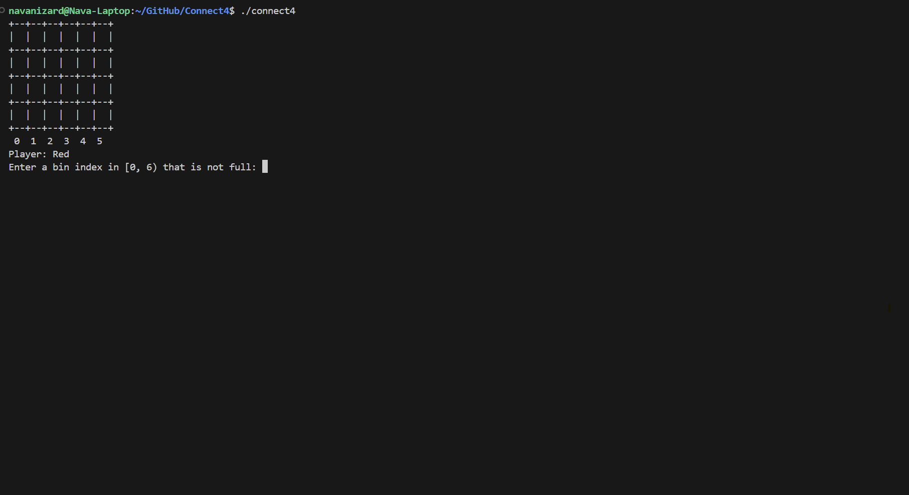
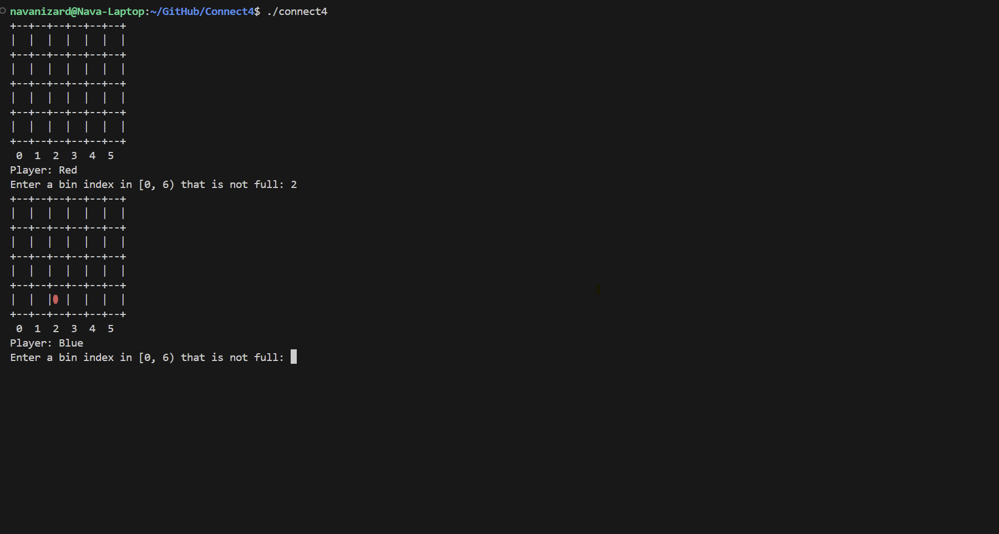
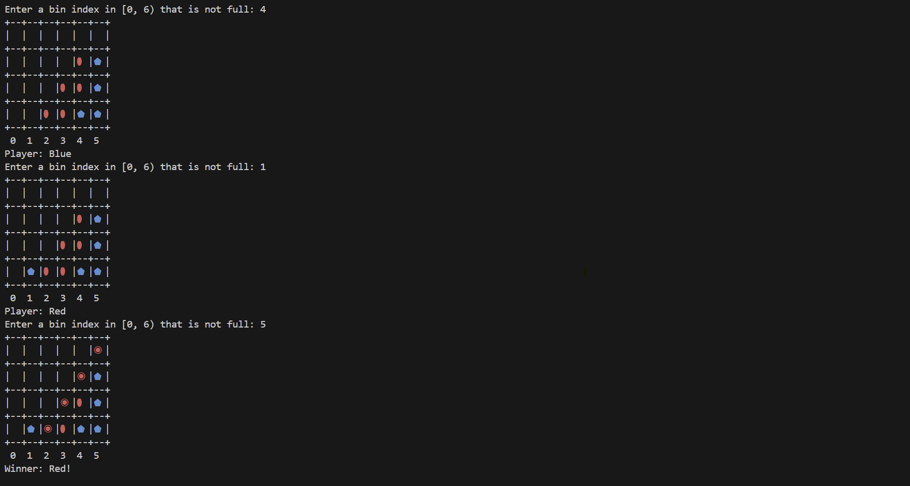
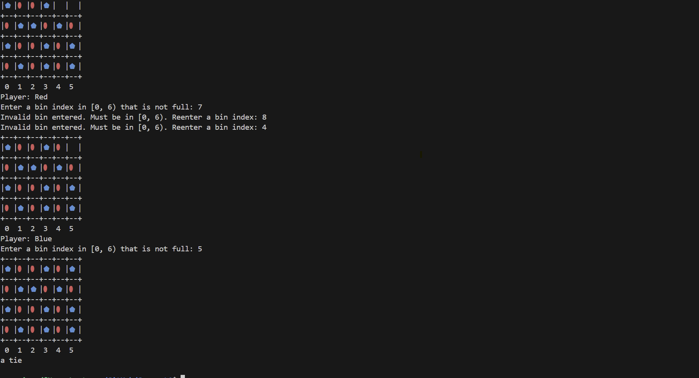

# Connect 4 (Command Line Game)

This is a **two-player Connect 4 game** built in C++ that runs in the command line. Developed for **CSCI 135: Software Analysis & Design I** at Hunter College, this project was an opportunity to practice object-oriented programming, dynamic data structures, and algorithmic logic.

## 🎮 How It Works

The game simulates a standard Connect 4 match between two players (Red 🔴 and Blue 🔷). Each player takes turns dropping a "ball" into a column (called a *bin*). The first player to connect four of their own pieces **horizontally**, **vertically**, or **diagonally** wins the game. If the board fills up before anyone wins, the game ends in a **tie**.

Key features:

- **Dynamic Grid**: The board size is customizable via constructor parameters (default is 6 bins × 4 capacity).
- **Interactive Gameplay**: Players input their desired column during each turn.
- **Win Detection**: The game checks for win conditions (horizontal, vertical, diagonal) after every move.
- **Visual Board**: Uses ASCII/Unicode symbols and color codes to make the board easy to read.
- **Highlighting the Win**: When a player wins, their winning sequence is marked with a different shape/color for clarity.

## 📸 Screenshots
**Welcome Screen:**



**First Move**



**Win in Diagonal**



**Tie**



## 🛠️ How to Play

1. **Compile the program:**
   ```bash
   g++ main.cpp Board.cpp -o connect4
   ```
2. Run the executable:
    ```bash
    ./connect4
    ```
3. Follow the on-screen prompts:

  - Enter the column number (bin index) where you want to drop your ball.
  
  - Watch the game board update after each move.
  
  - The game continues until there is a winner or the board is full.

## 📂 File Overview
- `Board.hpp`: The header file declaring the `Board` class and its methods.
- `Board.cpp`: The main implementation of the `Board` class, including game logic.
- `main.cpp`: The main driver file that initializes and starts the game.
- `README.md`: This file.

## 🧩 Concepts Practiced

- **Object-Oriented Design:** Built around a `Board` class that manages the game state.
- **Dynamic Memory & Vectors:** The board is a 2D vector that grows dynamically as pieces are added.
- **Input Validation:** Ensures players can’t enter out-of-bounds or full columns.
- **Modular Design:** Each win condition (horizontal, vertical, diagonal) is implemented in its own method for clarity and reuse.
- **Terminal UI:** Uses Unicode and ANSI escape codes for colored and stylized output.

## 🚀 Potential Enhancements

- Add **AI** to allow single-player mode.
- Add a **menu** for choosing board size or viewing instructions.
- Improve the visual display to work on all terminals (cross-platform testing).
---

This project helped solidify my understanding of game loops, object-oriented programming, and terminal I/O in C++. Hope you enjoy playing it as much as I enjoyed building it!

## 🔐 License

This project is licensed under the MIT License. See the LICENSE file for more details.
